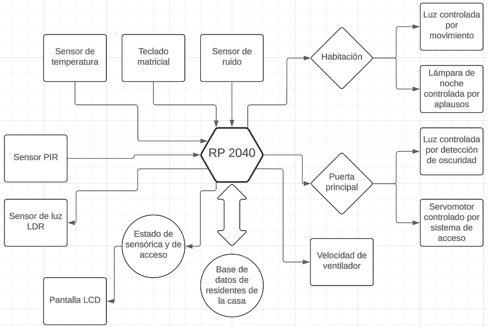

# Proyecto del curso de Electrónica Digital III

## Nombre del proyecto
DomoSync

## Descripción del proyecto
El desarrollo de este apartamiento inteligente es un proyecto de domótica enfocado en la integración de varios subsistemas bajo un control centralizado a través de un microcontrolador, la Raspberry Pi Pico 2040. 
El sistema incluye un sensor de reconocimiento de ruido, que detecta aplausos para encender o apagar la luz de un cuarto, y un teclado matricial que permite el control de acceso a la puerta principal de la casa al ingresar un código correcto. 
Además, el sistema utiliza un sensor de temperatura, que en conjunto con un controlador PI, ajusta la velocidad de un ventilador para mantener la temperatura deseada en el ambiente. 
Para la detección de movimiento, se implementa un sensor PIR, el cual activa la luz de la puerta principal cuando detecta alguien cerca a la puerta principal. 
Todos estos subsistemas están conectados a una pantalla LCD, que muestra el estado de los sensores y el acceso, proporcionando información en tiempo real.
Así, cada subsistema se comunica con la RP2040, la cual procesa las entradas de los sensores y toma decisiones como encender luces, abrir la puerta o ajustar la ventilación. 
El diagrama de bloques mostrado a continuación ilustra la interacción entre los componentes principales del proyecto.

## Requisitos funcionales

### Sensor de reconocimiento por aplauso - Lámpara de noche
El sistema activará o desactivará la lámpara de noche mediante el reconocimiento de un aplauso. 
El sensor de sonido se comunica con la Raspberry Pi Pico a través de comunicación digital directa (GPIO) o analógica. 
En el caso de la comunicación digital, el sensor envía una señal binaria cuando detecta un aplauso. 
Si se emplea un sensor analógico, este enviará una señal proporcional a la intensidad del sonido, la cual se conecta a un pin ADC para procesar los datos con mayor precisión, permitiendo ajustar la sensibilidad del sistema. 
Cuando la lámpara esté apagada y se detecte un aplauso, esta se encenderá; si ya está encendida, un aplauso la apagará. 
El sistema debe procesar la entrada de sonido en un tiempo máximo de 1 segundo para asegurar una respuesta rápida y evitar retrasos. 
Si se detectan múltiples aplausos en menos de 3 segundos, estos serán ignorados para prevenir el parpadeo indeseado de la lámpara.

### Sistema de acceso mediante teclado - Puerta principal
La puerta principal se desbloqueará mediante la introducción de un código de 4 dígitos en el teclado. 
Si el usuario no ingresa el código completo en un plazo máximo de 10 segundos, el sistema reiniciará el proceso, obligando a introducir nuevamente la clave. 
Al ingresar un código incorrecto, se activará una alarma visual y se mostrará "Acceso denegado" en el LCD. 
La comunicación entre el teclado y la Raspberry Pi Pico se realizará a través de pines GPIO, garantizando una respuesta rápida y precisa. 
Adicionalmente, el sistema asegurará que los datos introducidos sean procesados de manera eficiente, minimizando errores de lectura.

### Control de temperatura - Control PI del ventilador
El sistema ajustará la velocidad del ventilador mediante un control PI, basado en las lecturas de temperatura obtenidas cada 2 segundos por un sensor analógico. 
La velocidad del ventilador se ajustará proporcionalmente en función de valores de referencia predefinidos para mantener una temperatura agradable en el ambiente. 
Si la temperatura alcanza un límite máximo (por ejemplo, 30°C), el ventilador operará a su máxima velocidad, y si desciende por debajo de un límite mínimo (por ejemplo, 18°C), el ventilador se apagará para optimizar el consumo energético. 
La comunicación con el sensor de temperatura podría realizarse utilizando protocolo analógico para capturar las variaciones continuas del ambiente, mientras que el control del ventilador podría gestionarse mediante GPIO o PWM.

### LCD para muestreo de estado de sensores y acceso
El LCD mostrará información relevante sobre el estado del sistema, incluyendo notificaciones de acceso autorizado o denegado y la condición operativa de dispositivos conectados, como el ventilador. 
El procesamiento de datos garantizará que la pantalla se actualice con un tiempo de respuesta máximo de 2 segundo, brindando al usuario una retroalimentación clara. 
La comunicación I2C permitirá la transmisión eficiente de datos entre el microcontrolador y la pantalla, siendo este el protocolo de comunicación del LCD, minimizando interferencias. 
Para evitar solapamientos, se implementará una separación clara en los tiempos de comunicación entre el LCD y el sensor de temperatura, asegurando que no se envíen datos al LCD mientras se leen los valores del sensor. 
Además, se priorizarán las tareas; si se recibe una entrada del teclado, se dará prioridad a su procesamiento, permitiendo que la lectura del sensor de temperatura se posponga brevemente si es necesario, sin comprometer la frecuencia de actualización del sensor. 
En términos de seguridad, se implementará un control de errores básico para evitar lecturas erróneas o datos incompletos durante la comunicación.

### Sensor PIR - Movimiento para detección de presencia en la luz del cuarto
El sensor PIR se utilizará para detectar movimiento y encender la luz del cuarto al reconocer la presencia de una persona. 
El sistema garantizará un procesamiento eficiente, con un tiempo de respuesta máximo de 6 segundos, asegurando que la luz se encienda rápidamente al detectar movimiento. 
El sensor PIR proporciona una salida digital, generando un pulso alto al detectar movimiento y volviendo a bajo cuando no se detecta presencia. 
Este pulso se conectará directamente a un pin GPIO de la Raspberry Pi Pico, lo que facilita una respuesta rápida. 
El sistema usará un relé para proporcionar aislamiento eléctrico entre la Raspberry Pi Pico y el circuito de la luz, protegiendo el microcontrolador de picos de voltaje o corrientes que podrían dañarlo. 
Se implementarán controles para ajustar la sensibilidad del sensor PIR, evitando falsas alarmas causadas por objetos pequeños o mascotas. 
Si no se detecta movimiento en un lapso de 1 minuto, la luz del cuarto se apagará automáticamente.

### Sensor de luz - Control de iluminación para la puerta de la calle
El sistema utilizará un sensor de luz digital para detectar la intensidad lumínica exterior y encender automáticamente la luz de la calle (puerta principal) al anochecer. 
Este sensor proporcionará una salida digital, enviando un pulso alto cuando la luz ambiental caiga por debajo de un umbral predefinido (indicado como "noche") y un pulso bajo cuando haya suficiente luz (indicado como "día"). 
Este pulso se conectará directamente a un pin GPIO de la Raspberry Pi Pico, permitiendo un control rápido y eficiente de la iluminación. 
El tiempo de respuesta del sistema será de un máximo de 10 segundos para reaccionar a cambios en la luz ambiental. 
Además de esto el sistema también permitirá ajustes en el umbral de detección de luz, ofreciendo al usuario la posibilidad de definir cuánta oscuridad se necesita para encender la luz.

## Requisitos NO funcionales
El sistema es propenso a fallos de software por los múltiples sensores empleados no es posible garantizar el correcto funcionamiento de todo el sistema en general. 
Sin embargo, es posible garantizar ciertas características individuales de los componentes del sistema.
### Escalabilidad
La base de datos del sistema de acceso debe ser capaz de almacenar por lo menos hasta 8 usuarios diferentes.
### Usabilidad
El LCD facilita al usuario visualizar el estado de los sensores y muestra mensajes que confirman si el acceso ha sido autorizado o denegado.
### Tiempos de respuesta
El sistema de acceso debe ser capaz de notificar al usuario si el acceso ha sido autorizado o denegado en menos de 5 segundos después de digitadas la ID y contraseña de usuario.
## Escenario de pruebas
1. Escenario 1: Prueba del Sensor de Ruido (Aplauso)

Condición inicial: La luz del cuarto está apagada.

Acción: Aplaudir cerca del sensor.

Resultado esperado: La luz del cuarto debe encenderse en respuesta al aplauso.

Prueba adicional: Aplaudir nuevamente debe apagar la luz.

2. Escenario 2: Prueba del Sistema de Acceso (Teclado matricial)

Condición inicial: La puerta está cerrada.

Acción: Ingresar un código de 6 dígitos en el teclado matricial.

Resultado esperado: Si el código es correcto, el actuador (servomotor) debe desbloquear la puerta y en la LCD se debe mostrar un mensaje de “Acceso concedido”. Si el código es incorrecto, la puerta debe permanecer cerrada y el LCD debe mostrar “Acceso denegado”.

Pruebas adicionales: Ingresar un código erróneo varias veces para asegurar que el sistema maneja bien los errores de autenticación y el bloqueo de usuarios. 
Verificar el funcionamiento de las opciones de cambio de contraseña de un residente y agregación o eliminación de usuario de un residente.

3. Escenario 3: Prueba del Control de Temperatura (Ventilador con control PI)

Condición inicial: La temperatura ambiente es baja, y el ventilador está apagado o funcionando a velocidad mínima.

Acción: Simular un aumento en la temperatura ambiente utilizando una fuente de calor controlada cerca del sensor.

Resultado esperado: A medida que la temperatura aumenta, el control PI debe ajustar la velocidad del ventilador de manera gradual para mantener la temperatura estable dentro de un rango definido.

Prueba adicional: Al retirar la fuente de calor, la velocidad del ventilador debe disminuir o apagarse conforme la temperatura vuelva a su nivel normal.

4. Escenario 4: Prueba del Sensor PIR (Movimiento)

Condición inicial: No hay movimiento en la habitación o área cubierta por el sensor PIR, y la luz de la puerta principal está apagada.

Acción: Caminar dentro del área de detección del sensor PIR.

Resultado esperado: La luz de la puerta principal debe activarse un lapso de tiempo breve tras la detección de movimiento.

Prueba adicional: Permanecer quieto o salir del área de detección debe apagar dicha luz después de un minuto de no detectar movimiento.

5. Escenario 5: Prueba de Monitoreo en LCD

Condición inicial: El sistema está encendido y los sensores están activos.

Acción: Monitorear las actividades de cada uno de los sensores mencionados anteriormente, asegurando que la LCD muestre el estado de acceso, el funcionamiento de los sensores de luz, PIR, y temperatura en tiempo real.

Resultado esperado: La LCD debe actualizarse dinámicamente, mostrando el estado del sistema en todo momento sin retrasos de tiempo significativos. 
El muestreo del estado del sistema debería ser con avisos del estado de cada sensor que se visualicen en la LCD, mostrados en intervalos de tiempo distintos. 
Mientras que los avisos relacionados con el sistema de acceso interrumpen la visualización de los avisos anteriores sólo cuando se ha realizado un intento de autenticación de usuario, para cualquiera de las opciones disponibles para la persona.

## Presupuesto
Lista de Componentes y Costos:
### Raspberry Pi Pico W RP 2040:
o	Aliexpress: $4250 (precio de bienvenida) + $8700 (envío). Entrega en 15-21días.
	https://es.aliexpress.com/item/1005002733449265.html?spm=a2g0o.productlist.main.13.3d80ANdyANdyrt&algo_pvid=906cd4d2-fc49-4069-a30b-2b62506e82f2&utparam-url=scene%3Asearch%7Cquery_from%3A
o	Sigma Electrónica: $35700 + Costo de Envío. 
	https://www.sigmaelectronica.net/producto/rpi-pico-w/ 
o	I+D didácticas Electrónica: $44625
	https://didacticaselectronicas.com/index.php/component/virtuemart/view/productdetails/virtuemart_product_id/12335/virtuemart_category_id/230

### Fuente de Alimentación / Adaptador 5 VDC
o	Bigtrónica: Adaptador de Voltaje 5V 1A. $6500
	https://www.bigtronica.com/fuentes-de-alimentacion/adaptadores/220-adaptador-de-voltaje-5v-1a-5053212002206.html
o	Bigtrónica: Adaptador de Voltaje 5V 3A. $12000.
	https://www.bigtronica.com/fuentes-de-alimentacion/adaptadores/66-adaptador-de-voltaje-5v-3a-5053212000660.html
o	I+D didácticas Electrónica: Adaptador 5V – 3A. $13900
	https://didacticaselectronicas.com/index.php/component/virtuemart/view/productdetails/virtuemart_product_id/6378/virtuemart_category_id/824
o	Sigma Electrónica: Fuente 5V 2A. $23800
	https://www.sigmaelectronica.net/producto/fuente5v2aplug/

### Pantalla LCD:
o	I+D didácticas Electrónica: Display LCD 16x2 interfaz I2C. $17500
	https://didacticaselectronicas.com/index.php/component/virtuemart/view/productdetails/virtuemart_product_id/11418/virtuemart_category_id/397
o	I+D didácticas Electrónica: Display LCD 20x4 interfaz I2C Amarillo. $32300
	https://didacticaselectronicas.com/~didactic/index.php/view/productdetails/virtuemart_product_id/11676/virtuemart_category_id/397
o	Sigma Electrónica: Display LCD 20x4 Interfaz I2C Amarillo. $35700 + envío
	https://www.sigmaelectronica.net/producto/lcd2004a-ama-i2c/
### Teclado Matricial
o	I+D didácticas Electrónica :Teclado Matricial de Membrana 4x4. $4300
	https://didacticaselectronicas.com/~didactic/index.php/view/productdetails/virtuemart_product_id/1157/virtuemart_category_id/2
o	I+D didácticas Electrónica: Teclado matricial de 16 teclas (4x4). $15800
	https://didacticaselectronicas.com/~didactic/index.php/view/productdetails/virtuemart_product_id/202/virtuemart_category_id/2
o	Bigtrónica: Teclado Matricial 4x4. $15000
	https://www.bigtronica.com/sensores/touch/3432-teclado-matricial-4x4-5053212034320.html
### Motor
o	Bigtrónica: Motor DC 3 – 6V. $2000
	https://www.bigtronica.com/motores/dc/2591-motor-42vdc-20000rpm-con-helices-5053212025915.html?search_query=motor&results=317
-	Hélice
o	Bigtrónica: Aspa Plástica 50mm. $1700
	https://www.bigtronica.com/robotica-kit-s/poleas-pinones/2163-aspa-plastica-50mm-5053212021634.html?search_query=helice&results=28
o	I+D didácticas Electrónica. Ventilador 5V 0.18A 50x50x10mm $7050
	https://didacticaselectronicas.com/~didactic/index.php/view/productdetails/virtuemart_product_id/7644/virtuemart_category_id/791
### Sensor de Temperatura
o	LM35 $10000 + Placa de circuito Impreso $1600 + resistencia + amplificador LM358 $500
o	Bigtrónica: Sensor de Temperatura y Humedad I2C HTU21D. $18000
	https://www.bigtronica.com/sensores/temperatura/1175-sensor-de-humedad-y-temperatura-htu21d-5053212011758.html?search_query=sensor+de+temperatura&results=732
o	Bigtrónica: Módulo Sensor de Temperatura Analógico Termistor NTC. $4500
	https://www.bigtronica.com/sensores/temperatura/145-sensor-temperatura-analogo-tarjeta-5053212001452.html?search_query=sensor+de+temperatura&results=732
o	I+D Didáticas y electrónica. Sensor de temperatura y humedad AHT21B $15200
	https://didacticaselectronicas.com/~didactic/index.php/component/virtuemart/view/productdetails/virtuemart_product_id/11144/virtuemart_category_id/42

### Sensor de movimiento PIR
o	Bigtrónica. $5200
	https://www.bigtronica.com/sensores/distancia-movimiento/161-sensor-de-movimiento-pir-5053212001612.html?search_query=PIR&results=35
o	I+D Didácticas Electrónica: $5200

### Modulo Sensor de Sonido KY -038
o	Bigtrónica: $3500
	https://www.bigtronica.com/sensores/sonido/120-tarjeta-sensor-de-sonido-5053212001209.html?search_query=sensor+de+sonido&results=292

### Sensor de Luz LDR:
o	Bigtrónica: $3200
	https://www.bigtronica.com/sensores/luz/143-tarjeta-sensor-de-luz-ldr-5053212001438.html?search_query=sensor+de+luz&results=323
-	MDF 4mm
o	HomeCenter. MDF 4mm. 1.83x2.44m. $59900. $13.638m²
	https://www.homecenter.com.co/homecenter-co/product/884235/mdf-4mm-183x244-metros/884235/

--- 

Herramientas y Equipos:
-	Visual Studio - Raspberry Pi Pico
-	Fusion 360 – Diseño de Prototipo
-	Fuentes de Laboratorio

Costos de Diseño y Prototipado:
-	Cortadora Laser disponible en el laboratorio de prototipado de la Universidad de Antioquia
-	Software para diseño de corte laser: Fusion 360.
-	Madera MDF.

--- 

### Presupuesto total.
Más económico: 

•	Componentes = $55500

•	Prototipado = $60000

•	TOTAL = $115500

Más costoso:

•	Componentes = $147000

•	Prototipado = $60000

•	Total = $207000

## Repositorio
https://github.com/GenCabMon/proy_Domosync.git
